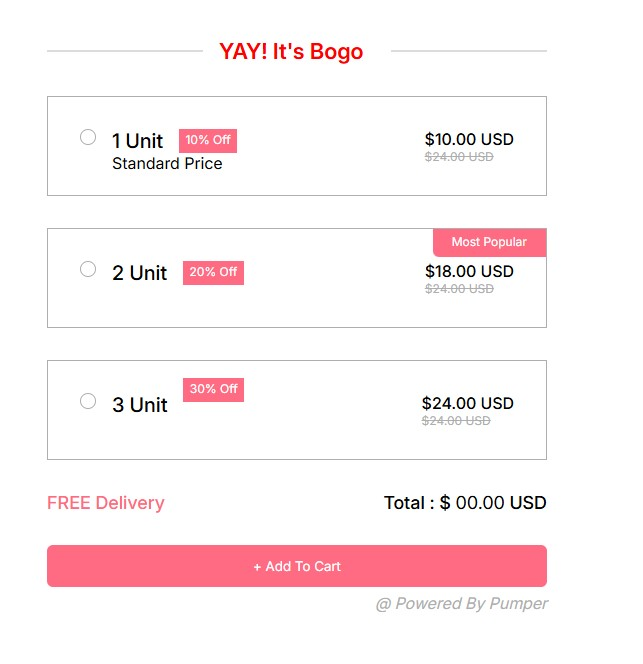

# 🎉 BOGO Offer Product Selector

This is a responsive and interactive **BOGO (Buy One Get One)** style product selection interface inspired by common e-commerce promotional widgets.

## ✨ Features

- 👕 Users can select between **1 Unit, 2 Units, or 3 Units**.
- 💸 Discount badges and dynamic pricing applied for each option:
  - 1 Unit: 10% Off
  - 2 Units: 20% Off
  - 3 Units: 30% Off
- 🟣 **Dynamic UI Behavior**: Selected option box enlarges and highlights with pink border.
- ✅ **UI transition effect** that highlights the selected option by enlarging the box and shrinking others.
- 🎨 Custom radio buttons styled with **pink** instead of default blue.
- 🔄 **Live Price Update**: Total price updates dynamically as user selects an option.
- 🔽 Users can select **Size** and **Color** for multiple units via dropdowns.

## 🛠️ Technology Stack

- **HTML5** – Structure of the interface
- **CSS3** – Custom styles and animations
- **JavaScript (Vanilla JS)** – UI interactivity and dynamic price updates

## 🚀 Extra Functionalities Added

- ✅ **Custom-styled pink radio buttons** using CSS to enhance branding.
- ✅ **Dynamic total price calculation** in real-time based on user selection.

## 📸 Preview

---

## 💖 Special Thanks

Thank you for taking the time to check out this project!  
I built this interface **entirely from scratch**, without using any third-party website builders or UI libraries. Every line of code—from layout to functionality—was written manually to ensure complete understanding and control over the final result.

Your feedback, suggestions, and stars ⭐ on GitHub are always appreciated!

---

